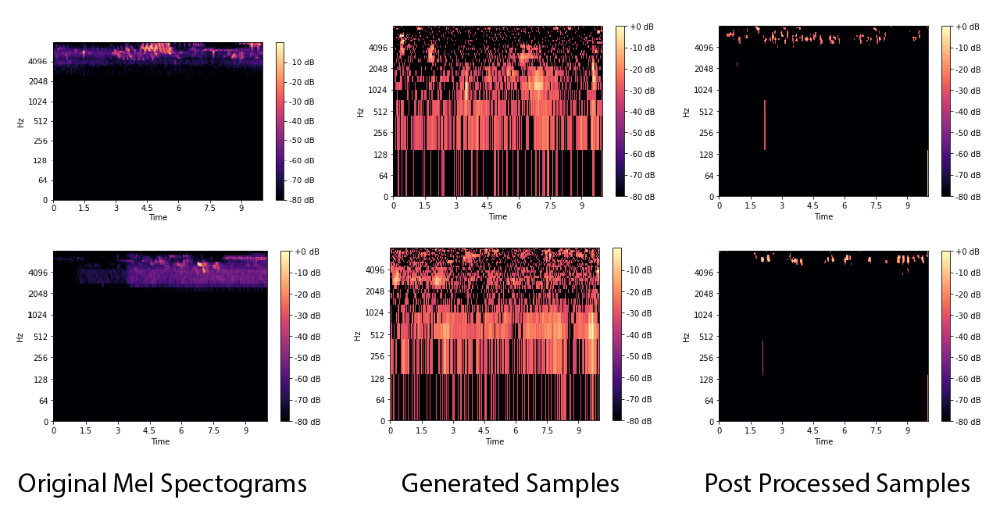

# Birdcall generation using Score SDE
This repo is part of the project ["Reproduce Neural ODE and SDE"][projectlink] which was undertaken under [HuggingFace Flax/JAX community week 2021][comweeklink]. The full submition can be found [here][full-sub]. 

We used the model proposed in the paper [Score-Based Generative Modeling through Stochastic Differential Equations][score-sde-paper] to generate Birdcall using [Mel Spectograms][Mel_specto]. We used the [notebook][tutorial-notebook] provided in the original [repo][ori-repo] and fne tuned it to our Mel Spectogram dataset. 

A sample of generated bird call. 

https://user-images.githubusercontent.com/49194488/126141446-0fd0effa-a262-447d-9701-44d0d38825b5.mp4

## Dependencies

In order to run the sampler or training script, required dependecies are required. 
### JAX and Flax

For JAX installation, please follow [here][jaxinstalllink].

or simply, type
```bash 
pip install jax jaxlib
```

For Flax installation,
```bash
pip install flax
```

### For audio generation and Mel Spectogram

* Librosa
* Soundfile

### Other

* Numpy
* Matplotlib
* torch
* torchvision
* tensorflow
* tqdm
* scipy

# Bird Call generation Score SDE Sampler and Trainer
These are the codes for the bird call generation score sde model. 
<code>core-sde-sampler.py</code> will execute the sampler. The sampler uses pretrained weight to generate bird calls. The ckpt.flax file is the weight.

 

For using different sample generation parameters change the argument values. For example,
```bash
python main.py --sigma=25 --num_steps=500 --signal_to_noise_ratio=0.10 --etol=1e-5 --sample_batch_size = 128 --sample_no = 47
``` 
In order to generate the audios, these dependencies are required,
```bash 
pip install librosa
pip install soundfile
```
In order to train the model from scratch, please generate the dataset using this [link][kaggle-dataset]. The dataset is generated in kaggle. Therefore, during training your username and api key is required in the specified section inside the script. 
```bash
python main.py --sigma=35 --n_epochs=1000 --batch_size=512 --lr=1e-3 --num_steps=500 --signal_to_noise_ratio=0.15 --etol=1e-5 --sample_batch_size = 64 --sample_no = 23
``` 

We have also provided the colab notebook we used to train the model. More generated bird call samples can be found [there][colab-notebook] apart from [here][samples].


[projectlink]: https://discuss.huggingface.co/t/reproduce-neural-ode-and-neural-sde/7590
[comweeklink]: https://github.com/huggingface/transformers/tree/master/examples/research_projects/jax-projects#projects
[full-sub]: https://huggingface.co/flax-community/NeuralODE_SDE
[score-sde-paper]: https://arxiv.org/abs/2011.13456 
[ori-repo]: https://github.com/yang-song/score_sde
[tutorial-notebook]: https://colab.research.google.com/drive/1SeXMpILhkJPjXUaesvzEhc3Ke6Zl_zxJ?usp=sharing
[Mel_specto]: https://towardsdatascience.com/getting-to-know-the-mel-spectrogram-31bca3e2d9d0
[jaxinstalllink]: https://github.com/google/jax#installation
[kaggle-dataset]: www.kaggle.com/ibraheemmoosa/birdsong-spectogram-generation
[colab-notebook]: https://colab.research.google.com/drive/1AbF4aIMkSfNs-G__MXzqY7JSrz6qvLYN 
[samples]: https://github.com/mandelbrot-walker/Birdcall-score-sde/tree/main/generated_samples
